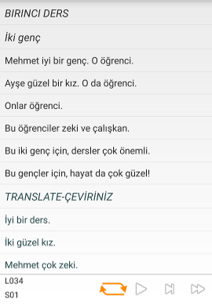
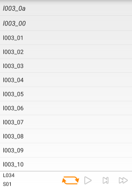

### When starting Selma, I get a lot of warnings and hints. How can I start learning?
You need to buy a language course (book and MP3 pack, or book and PC software) from Assimil in order to use Selma.

### Who or what is Assimil?
In order to get more info on Assimil courses, please visit their [homepage](http://www.assimil.com/). In my opinion their courses are a great way of learning a new language. I, the author of Selma, am not affiliated with Assimil. I am simply a fan of their "Turkish with Ease" course.

### Should I use the MPs from the MP3 pack or from the PC software?
If you have the choice, it is recommended to use the files from the MP3 pack. The PC software is probably great (I've never used it), but the best experience with Selma is gained by using the MP3 packs. These MP3 packs contain the lessons texts in written form, so that you will see the spoken text on your phone while listening. A picture says more than a thousand words:
<figure class="half">
	
	
</figure>
On the left you see Selma showing a lesson with files from the "Assimil Turkish With Ease" MP3 pack, on the right you see Selma showing a lesson with files from the "Assimil Russian" PC software.

### I converted the Audio CD to MP3! Why doesn't this work?
According to my knowledge the Audio-CDs use one track per lesson, whereas the MP3 pack or PC software use several files for each lesson. The advantage of this is, that you can easily jump to a specific point in each lesson. But with one audio file per lesson Selma cannot work. Sorry! But on the other hand, the experience with using these files in Google Play Music (or whatever music player you prefer) will still work! 

### I would like to use Selma with the language course from company XYZ. Will this work?
Right now, Selma only supports courses from Assimil. But this is mainly due to the fact, that I don't own any other course. But if the course you are suggesting fulfulls a set of prerequesites, it might be possible to integrate the functionality in Selma. Of course, I will need your support in order to make this work. Please [leave a comment here]({{ %site.url% }}) or see my [contact page]({{ %site.url% }}/contact/).

### But I did copy the files from the Assimil MP3 pack or PC software to my phone! Why is it still not working?
After you have copied the MP3 files to your phone, Selma should automatically detect it. If not, please try turning off and on your phone. Then wait a few minutes before starting Selma. Android sometimes need some time to detect new MP3 files.

If it still doesn't work, please send me a mail. You can do that from within the app, [leave a comment here]({{ %site.url% }}), or see my [contact page]({{ %site.url% }}/contact/).
Until now Selma has only been tested with

* Turkish With Ease (MP3 pack)
* New Greek With Ease (MP3 pack)
* Spanish (MP3 pack)
* Russian (PC course)

If you want to try to use the app with a different course, I would be happy to receive your feedback (positive or negative) and will try to make the app work for you. In the beginning Selma worked only with "Turkish With Ease". The other courses were added after receiving user feedback.

### How much does Selma cost?
The app is free for everyone who already bought the Assimil MP3 pack and book. (The app of course also free for everyone else, it's just not of any use for anyone that doesn't have the MP3 pack.)

### I entered a lot of translations. How do I back-up this data?
Short answer: Copy the folder in which the MP3 files are stored to a PC. This will also back up the texts you entered.

Explanation: Whenever you enter a translation or correct any of the original texts, Selma will automatically create a text file that contains your text. The file is stored in the same directory as the MP3 file. E.g. if the MP3 is called "S01.mp3" and is stored in on your SD card in ".../assimil/turkish/L001-Turkish With Ease ASSIMIL", Selma will generate the following files:

* "S01_translate.txt" if you enter a translation
* "S01_translate_verbatim.txt" if you enter a literal translation
* "S01_orig.txt" if you enter or correct the original lesson text.

When Selma is scanning for lessons it automatically reads these files. This scanning takes place either on the initial start or when you start it from within the app.
